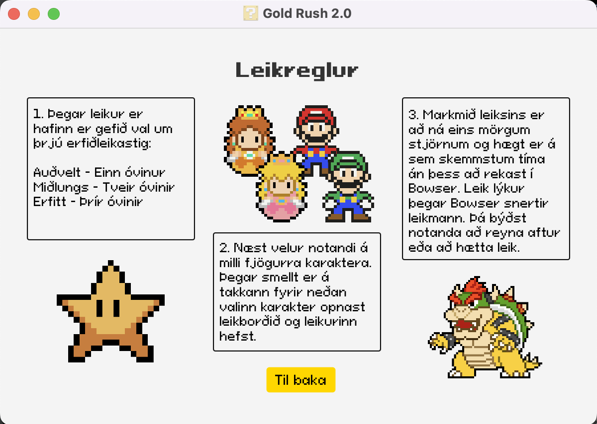
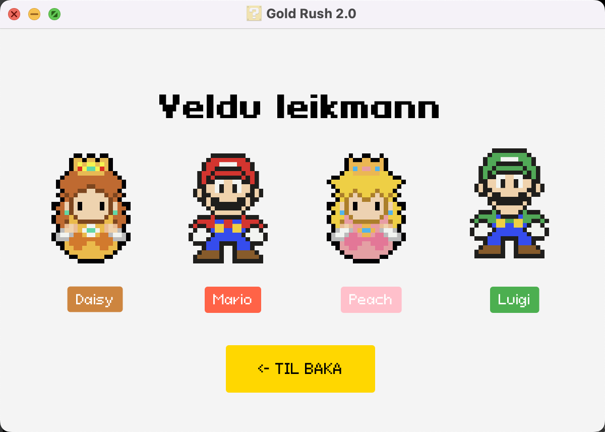
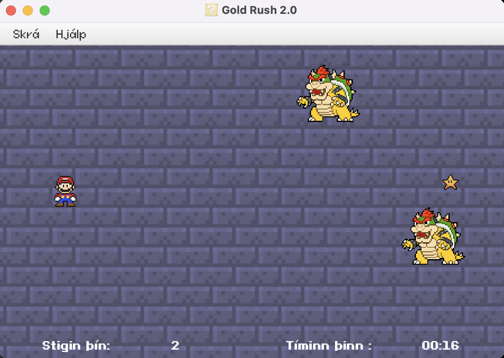

# GoldRush 2.0

> Endurbætt útgáfa af GoldRush — JavaFX leikur fyrir HBV202G.

## Version 1.0

Verkefnið er endurbætt útgáfa af GoldRush. Sá leikur var uppáhalds verkefnið hjá öllum þar sem hann gefur marga möguleika á að bæta við auka virkni sem gerir leikinn skemmtilegri og fjölbreytnari, og voru því allir sammála hvaða verkefni yrði valið.

Þetta verkefnið var frábrugðið hinum verkefnunum þar sem það var tölvuleikur og meira gagnvirkt en hin verkefnin. Við höfum allar mismunandi reynslur af tölvuleikjum og því viljum við prófa að útfæra leik á okkar hátt. Við vorum komnar með góðan grunn til að vinna með og því skemmtilegra að hugsa um hvernig við getum bætt við leikinn til að gera upplifunina fyrir notandann enn skemmtilegri. Viðmótið sjálft var með mestu möguleikana til að betrumbæta leikinn.

**Allar grunnkröfurnar eru þær sömu en þó nokkrar viðbætur:**

- Hægt er að velja mismunandi persónur sem uppfylla hlutverk grafarans.
- Hægt er að velja erfiðleikastig sem hefur áhrif á hversu margir óvinir birtast.
- Óvinur sem endar leikinn ef grafarinn rekst á hann.
- Breytt var leikjatímanum þar sem hann telur ekki lengur niður heldur telur áfram þangað til þú rekst á óvininn eða hættir í leik.

## Maven uppsetning

Verkefnið notar:

- **Java** 21
- **JavaFX** 21 (`javafx-controls`, `javafx-fxml`)
- **JUnit Jupiter** 5.10.0

### Plugins

| Plugin | Version | Group ID |
| --- | --- | --- |
| `maven-compiler-plugin` | 3.13.0 | `org.apache.maven.plugins` |
| `maven-surefire-plugin` | 3.3.0 | `org.apache.maven.plugins` |
| `maven-site-plugin` | 3.12.1 | `org.apache.maven.plugins` |
| `javafx-maven-plugin` | 0.0.8 | `org.openjfx` |
| `maven-shade-plugin` | 3.5.2 | `org.apache.maven.plugins` |
| `exec-maven-plugin` | 3.3.0 | `org.codehaus.mojo` |

Sjá nánar í [`pom.xml`](pom.xml).

## Maven goals sem eru studd

| goals | Lýsing |
| --- | --- |
| `mvn compile` | Þýðir verkefnið |
| `mvn test` | Keyrir JUnit prófin |
| `mvn exec:java` | Keyrir forritið í gegnum `goldrush.Launcher` |
| `mvn package` | Pakkar forritinu í eina fat jar skrá með `maven-shade-plugin` |
| `mvn site` | Býr til Maven site með Javadoc og hönnunarskjölum |
| `mvn javafx:run` | Keyrir leikinn beint í gegnum JavaFX plugin |

## Keyrsla í IDE

Til þess að keyra forritið með Maven þá fer einstaklingur í **Maven → Plugins → javafx → javafx:run**.

Annars er hægt að keyra það í gegnum `GoldApplication` og ýta á _run current file_.

> `vidmot.goldrush.GoldApplication` er mainClass fyrir JavaFX og `goldrush.Launcher` er mainClass fyrir fat jar.

## Pökkun og keyrsla á jar skrá

Til þess að pakka forritinu í eina keyranlega `.jar` skrá:

```bash
mvn package
```

Til þess að keyra forritið án IDE eða Maven:

```bash
./run.sh
```

Þetta keyrir `java -jar target/GoldRush-1.0-SNAPSHOT.jar` (Launcher klasinn er entry point).

## Leikurinn í keyrslu

| Leikreglur | Velja karakter | Leikur |
| :---: | :---: | :---: |
|  |  |  |

## Hönnunarskjöl
- [UML Class Diagram](docs/uml.md)
- [Design patterns](link) !!NOTE VANTAR!!
- [Javadoc](docs/javadoc/index.html) _(útbúið með `mvn site`)_

## Höfundar GoldRush 1.0

- Ana Margarida Delgado Costa, amd16@hi.is — [@anamargariida](https://github.com/anamargariida)
- Helga Björg Helgadóttir, hbh54@hi.is — [@helgsie](https://github.com/helgsie)

## Leyfi

Þetta verkefni er gefið út undir [MIT leyfi](LICENSE).
