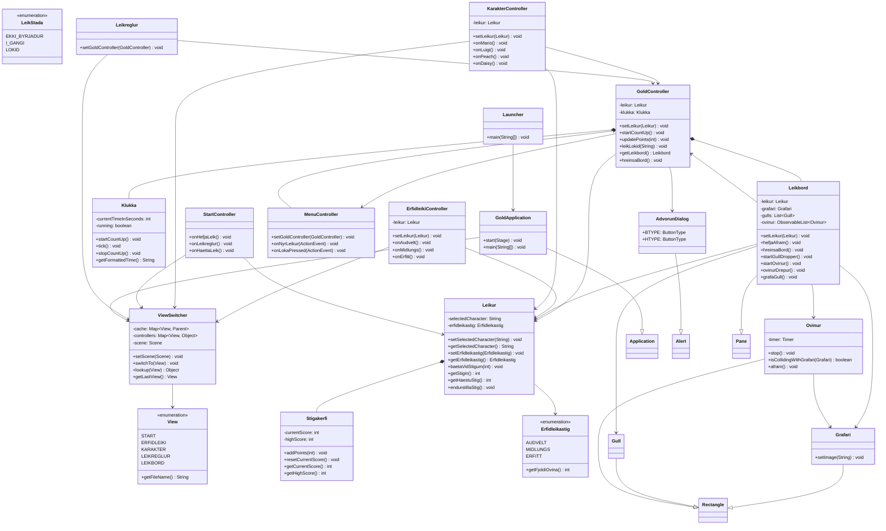

# UML Class Diagram

```mermaid
classDiagram

    %% Application entry points
    class GoldApplication {
        +start(Stage) void
        +main(String[]) void
    }
    class Launcher {
        +main(String[]) void
    }

    %% App utilities
    class ViewSwitcher {
        -cache: Map~View, Parent~
        -controllers: Map~View, Object~
        -scene: Scene
        +setScene(Scene) void
        +switchTo(View) void
        +lookup(View) Object
        +getLastView() View
    }
    class View {
        <<enumeration>>
        START
        ERFIDLEIKI
        KARAKTER
        LEIKREGLUR
        LEIKBORD
        +getFileName() String
    }

    %% Business Logic
    class Leikur {
        -selectedCharacter: String
        -erfidleikastig: Erfidleikastig
        +setSelectedCharacter(String) void
        +getSelectedCharacter() String
        +setErfidleikastig(Erfidleikastig) void
        +getErfidleikastig() Erfidleikastig
        +baetaVidStigum(int) void
        +getStigin() int
        +getHaestuStig() int
        +endurstillaStig() void
    }
    class Stigakerfi {
        -currentScore: int
        -highScore: int
        +addPoints(int) void
        +resetCurrentScore() void
        +getCurrentScore() int
        +getHighScore() int
    }
    class Klukka {
        -currentTimeInSeconds: int
        -running: boolean
        +startCountUp() void
        +tick() void
        +stopCountUp() void
        +getFormattedTime() String
    }
    class Erfidleikastig {
        <<enumeration>>
        AUDVELT
        MIDLUNGS
        ERFITT
        +getFjoldiOvina() int
    }
    class LeikStada {
        <<enumeration>>
        EKKI_BYRJADUR
        I_GANGI
        LOKID
    }

    %% Controllers
    class GoldController {
        -leikur: Leikur
        -klukka: Klukka
        +setLeikur(Leikur) void
        +startCountUp() void
        +updatePoints(int) void
        +leikLokid(String) void
        +getLeikbord() Leikbord
        +hreinsaBord() void
    }
    class StartController {
        +onHefjaLeik() void
        +onLeikreglur() void
        +onHaettaLeik() void
    }
    class ErfidleikiController {
        -leikur: Leikur
        +setLeikur(Leikur) void
        +onAudvelt() void
        +onMidlungs() void
        +onErfitt() void
    }
    class KarakterController {
        -leikur: Leikur
        +setLeikur(Leikur) void
        +onMario() void
        +onLuigi() void
        +onPeach() void
        +onDaisy() void
    }
    class MenuController {
        +setGoldController(GoldController) void
        +onNyrLeikur(ActionEvent) void
        +onLokaPressed(ActionEvent) void
    }

    %% Views
    class Leikbord {
        -leikur: Leikur
        -grafari: Grafari
        -gulls: List~Gull~
        -ovinur: ObservableList~Ovinur~
        +setLeikur(Leikur) void
        +hefjaAfram() void
        +hreinsaBord() void
        +startGullDropper() void
        +startOvinur() void
        +ovinurDrepur() void
        +grafaGull() void
    }
    class Grafari {
        +setImage(String) void
    }
    class Gull
    class Ovinur {
        -timer: Timer
        +stop() void
        +isCollidingWithGrafari(Grafari) boolean
        +afram() void
    }
    class Leikreglur {
        +setGoldController(GoldController) void
    }
    class AdvorunDialog {
        +BTYPE: ButtonType
        +HTYPE: ButtonType
    }

    %% Inheritance
    GoldApplication --|> Application
    AdvorunDialog --|> Alert
    Grafari --|> Rectangle
    Gull --|> Rectangle
    Ovinur --|> Rectangle
    Leikbord --|> Pane

    %% Composition
    Leikur *-- Stigakerfi
    GoldController *-- Leikbord
    GoldController *-- Klukka

    %% Associations
    Leikur --> Erfidleikastig
    GoldController --> Leikur
    GoldController --> MenuController
    GoldController --> AdvorunDialog
    Leikbord --> Leikur
    Leikbord --> Grafari
    Leikbord --> Gull
    Leikbord --> Ovinur
    Leikbord --> GoldController
    Ovinur --> Grafari
    ErfidleikiController --> Leikur
    ErfidleikiController --> ViewSwitcher
    KarakterController --> Leikur
    KarakterController --> GoldController
    KarakterController --> ViewSwitcher
    MenuController --> GoldController
    StartController --> ViewSwitcher
    StartController --> Leikur
    Leikreglur --> GoldController
    Leikreglur --> ViewSwitcher
    Launcher --> GoldApplication
    GoldApplication --> ViewSwitcher
    ViewSwitcher --> View
```